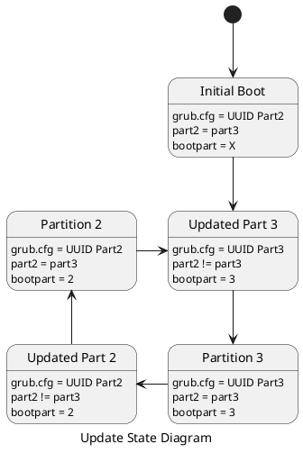

# simple-update

The simple-update package allows to do a A/B update schema using GRUB. 
To achieve this, four partitions are required. The first partitions stores the GRUB EFI bootloader. Two partitions hold the root filesystems while the third partition holds the bootflags.

```puml

caption Partitions and artifacts
skinparam monochrome true

node Part1 as "Bootloader" {
    folder Boot {
        folder EFI {
            artifact grub.cfg {

            }
        }
    }
}

node Part2 as "Partition2" {
 artifact "Rootfs 1" {
 }
}

node Part3 as "Partition3" {
 artifact "Rootfs 2" {
 }
}

node Part4 as "Bootflags" {
    artifact boot2{
    }
    artifact boot3{
    }
    artifact boot-failed{
    }
}
```

When the device is booted for the first time,
it will boot into partition 2 because it's UUID will be used inside GRUB.
Partition 2 and Partition 3 contain the same rootfs and the bootpart is empty.

### First update

When the first update is performed the following steps are performed:
1. Partition 3 is updated with the new rootfs
2. The boot partition flag **boot3** is created in the bootflags partition.
3. The grub.cfg is updated to contain the UUID of the new partition 3.
4. The device is rebooted.

### After Reboot

Now the device boots into the new partition.
1. If everything went fine, the old partition is updated with the content of the new rootfs.
2. Else if an error occured, the **boot-failed** flag is created.
    1. if **boot3** exists, Partition 3 as to be rolled back
        3. The grub.cfg is updated to contain the UUID of the old partition 2
        4. The device is rebooted
    2. else if **boot2** exists, Partition 2 as to be rolled back
        3. The grub.cfg is updated to contain the UUID of the old partition 3.
        4. The device is rebooted

3. Else if the **boot-failed** flag exists,
    1. if **boot3** exists,
        1. Partition 2 is copied to Partition 3
        2. The **boot2** flag is created
        3. The **boot-failed** flag is deleted
    1. if **boot2** exists,
        1. Partition 3 is copied to Partition 2
        2. The **boot3** flag is created
        3. The **boot-failed** flag is deleted

### Next update

When the next update occurs, the following steps are performed:
1. The simple-update looks for the boot partition flags, and
    1. if **boot3** exists, partition 2 is next partition to update, so
        1. Partition 2 is updated with the new rootfs
        2. The boot partition flag **boot2** is created.
        3. The grub.cfg is updated to contain the UUID of the new partition 2
        4. The device is rebooted
    2. else if **boot2** exists, partition 3 is the next partition to update, so
        1. Partition 3 is updated with the new rootfs
        2. The boot partition flag **boot3** is created in the bootflags partition.
        3. The grub.cfg is updated to contain the UUID of the new partition 3.
        4. The device is rebooted.
2. Go to **After Reboot**

